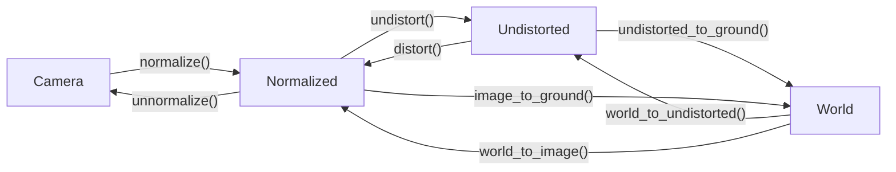
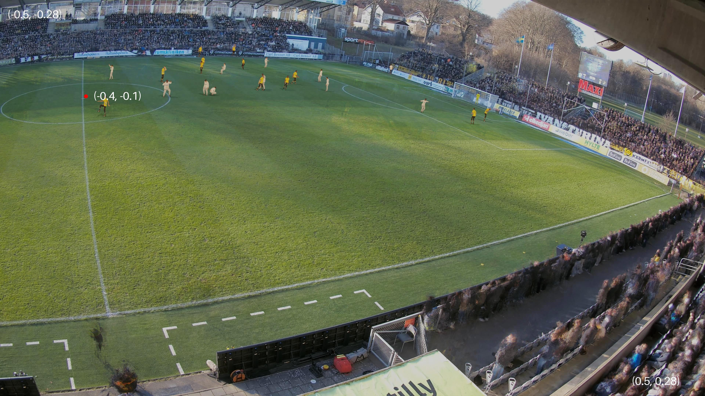
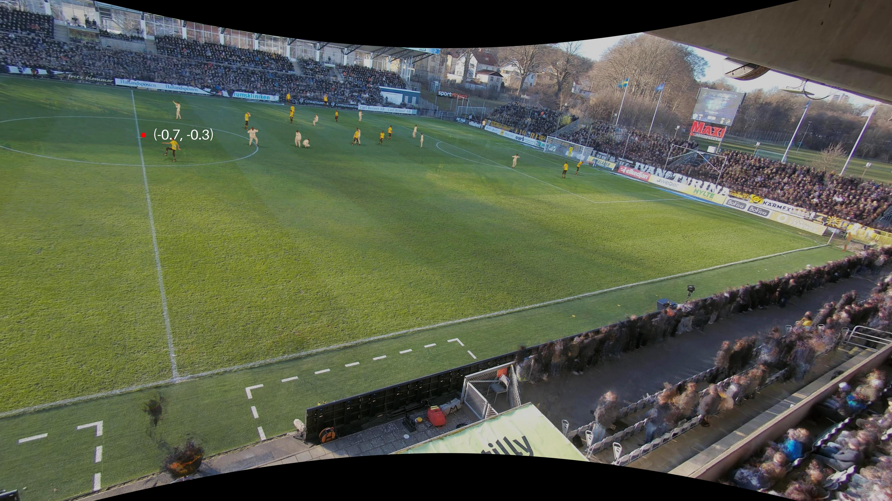
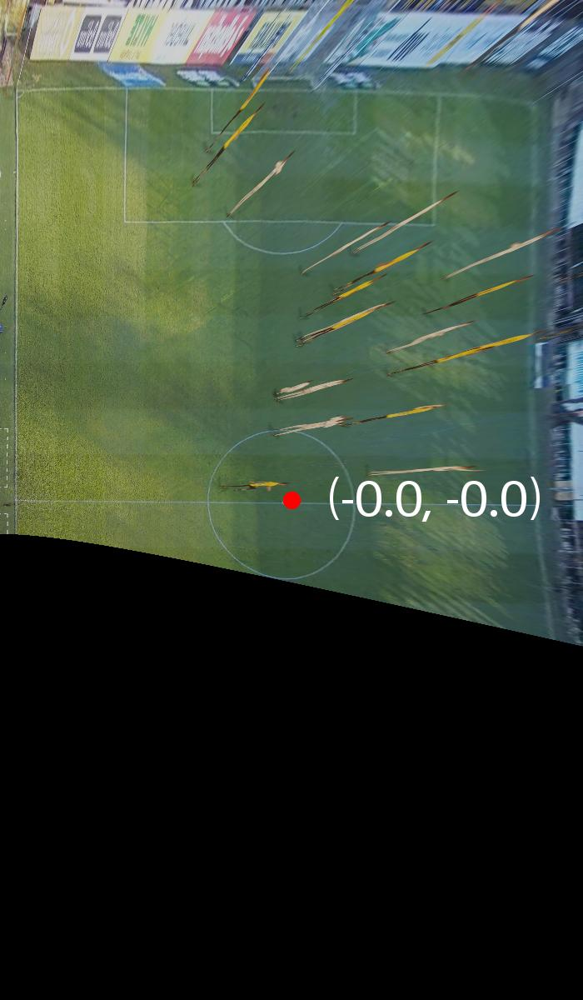

Coordinate Systems
==================

There are several different coordinate systems used (se pictures below), and functions to convert points between them. The World coordinates are either 3D or 2D ground coordinates with the last coordinate assumed to be 0.

Camera Image
------------

Normalized Image
----------------

Undistorted Image
-----------------

Ground Plane
------------

